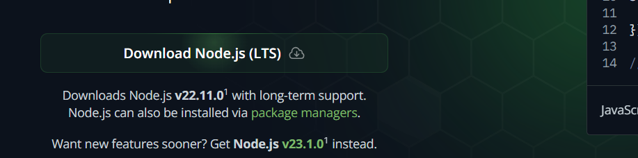
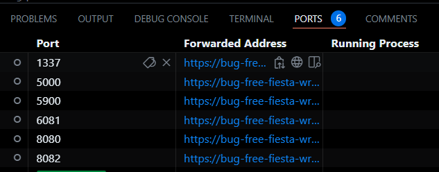

# Entry 1
##### 11/3/X24

### Context

I began working on my freedom project with big dreams in mind. I want to create an app that translates for immigrants. My Grandmother is an immigrant and when she came to the United States she was lost. It's hard to adjust to a new language and new laws. Immigration laws greatly affect the outcome of a persons life. So I want to make a website that uses and API and built in react. I am working with my partner Jacob Levit. Jacob Levit is a amateur software engineer, like me. He is proficient in understanding Cybersecurity and API's. I have worked with python and API's before to make small projects. Using this we want to combine our skills to use react, specifically node.JS to enhance the user experience. 

### Content

#### Task 1: Setting up Node.JS

To set up Node.js a person needs to understand what is node and Javascript libraries and frameworks. Frameworks take pre-written Javascript code to make it easier for the developer to code. Libraries help achieve specific tasks that you want. The thing they have in common is they help simplify development of a application. To set up Node.js I had to watch this video [video](https://www.youtube.com/watch?v=TlB_eWDSMt4). The first thing you need to do is install node. 
 You have to download node onto your device so I did I began learning node commands. 

#### Task 2: Beginning the learning process

To begin learning Node.js and react I had to go read first. So I went to the official websites of [React](https://react.dev/learn) and [Node](https://nodejs.org/docs/latest/api/). I opened a new file and began tinkering. I didn't know where to start to I began at the beginning. I started a [Tinkering file](https://github.com/calebg4205/tinker-tool). 
``` Javascript
const express = require('express');
const session = require('express-session');
const bodyParser = require('body-parser');

const app = express();
const PORT = 3000;
```
I learned this line of code is the most important. They tells the server where to go a what to do. So it required express and made express and node required. I began tinkering with this. My first challenge was to figure out the port. Since me and my partner had to work in Github codespaces we were forced to work around a lot of issue. Most computer's default to port 3000. The Github codespaces had different ports. We read a lot of articles and did some research to find you could find the ports in the IDE. 


### Engineering design process
My current stage of the EDP is defining the problem. I want to make it so immigrants have the same chance as anyone else. For that they need to know laws in their own language. I want everyone to have a fair shot. My problem is about equality and I believe mhy website will provide a fast and reliable way to make laws accessible to all. 

### skills
* Learning on your own: While studying React I had to learn a lot I didn't know about Javascript. I had to improvise and learn on my own. I big help was ChatGPT to explain concepts to me. I also want to thank my friend <b>Shi-Jun Weng</b> for giving me a roadmap. Learning on your own can be challenging, but no one truly learns on there own. They depend on other to teach them. I learned what it meant to really learn and develop my skills on my own. 
* How to use AI: This became a challenge for me as I discovered the power of ChatGPT in code. It can make things for you in an instant. Still I need to make things on my own to learn on my own. SO with some help from AI as a starting point I worked on my own. I tried to build things on my own even if they didn't work. It was worth it to learn. 

[Next](entry02.md)

[Home](../README.md)
