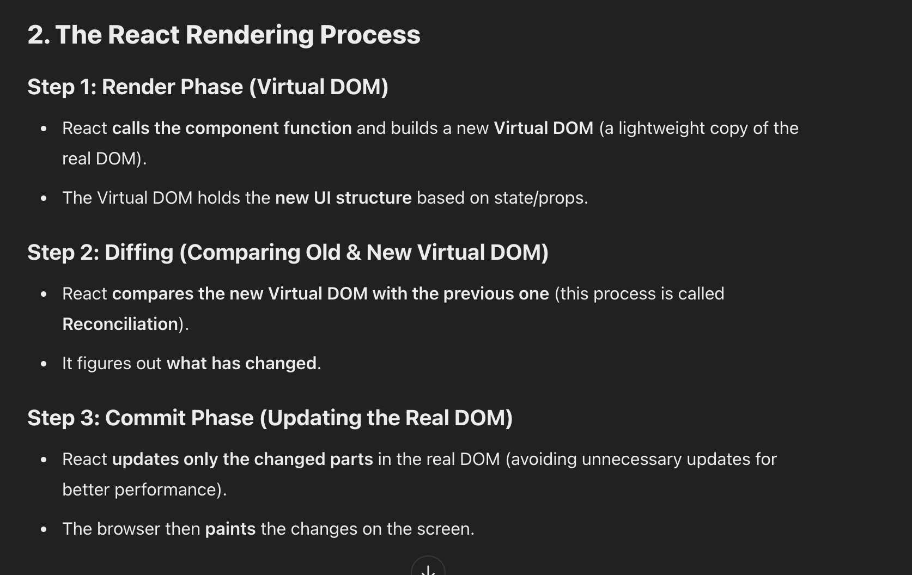

##### 03/12/25

### Context

Over the last month, I have been working on my understanding of React and Node.js. I completed my bookkeeping project relatively easily. Creating objects and keys made me better at understanding how to reuse code. Sadly, the computer I hosted the project on got corrupted, and I had to recycle it. Now, I am working on how to reintegrate code so it is usable. To do this, I began with [Bro Code's React video](https://www.youtube.com/watch?v=CgkZ7MvWUAA) for a solid foundation. I worked on trying to understand how both of them work together. I know that Node.js works to create a backend server that can handle requests, while React seems to work on the frontend, making it easier to write less code. Working on this for the last month has presented me with a lot of challenges.

### Challenge 1: Understanding and processing requests between the frontend and backend

When trying to build a framework for me and Jacob's project, I wanted to create reusable components we would definitely use. While making simple things like buttons and boxes, I ran into the problem of processing requests. I wanted the buttons to do something, but when the frontend button is clicked, it needs to travel to the backend. This confused me. After spending some time on the React documentation, I came across [useState](https://react.dev/reference/react/useEffect). useState allows the button to update dynamically without having to refresh the whole page. I decided to try it:

```js
import { useState } from 'react'

function NumberGoesUp() {
  const [plus, counting] = useState(0)

  return (
    <div>
      <p>Count: {plus}</p>
      <button onClick={() => counting(plus + 1)}>Cheese</button>
    </div>
  )
}

export default NumberGoesUp
```

What this does is create a reusable component that adds 1 to a button on click. When I wrote this, I struggled at first with `onClick`, but when I applied what I learned about the DOM, it became a much easier process. Setting `useState(0)` means the hook will always start at 0. The next time I reuse the function, it will have the same effect even on different pages. Learning [hooks](https://react.dev/reference/react/hooks) really opened up React for me. I could officially make a bunch of components with less code and have more time to make my webpage better.

### Challenge 2: Understanding component re-rendering and updating states

Components are pieces of reusable code that can be edited in the file to match the information. Basically, they are super dynamic and super useful when coding in JavaScript. Instead of manually remaking buttons constantly, I can simply call the function. React uses the Virtual DOM (a lightweight copy of the real DOM) to render based on states. When I was using states, I struggled to make them render correctly. When I make something on the original DOM, React will change it based on the context. I used ChatGPT to help me understand this concept:



Even then, I was still a little confused, so I started trying to apply it. My earlier example worked because the DOM will constantly re-render. It will compare the Virtual and real DOM. React is so efficient because it avoids any unnecessary rendering, making the webpage even faster.

### Engineering Design Process

At this point in the EDP, I am ready to move into making a prototype. I want to start applying my knowledge not only about code but also about immigration. This weekend, I will begin working on creating the app and applying my knowledge. I plan to combine my frontend skills with my partner, who built the translation API.

### Skills

1. **Learning to be stuck**: There were multiple times I struggled with understanding the material. Watching videos and reading articles still didn't help me understand. When I was trying to tinker, I didn't even know where to start. I tried so hard to force myself to know the answer. After about a week, I decided to take a break. I went back to the basics and reminded myself that it’s okay to not know everything. I was beginning to feel frustrated by the confusing language in the docs, but I decided to try looking for other sources. I used AI to help break down complex concepts and revisited parts of Bro Code’s videos if I was stuck. The idea of not knowing something scared me, and being stuck made me angry. Still, when I accepted that I was stuck, I was able to backtrack and relearn concepts.

2. **Staying Focused**: This applied not only to actually sitting down and doing my work but also while doing my work. The React documentation is filled with so much cool information. When I didn’t understand what it was referencing, I would go down a rabbit hole trying to understand a topic I didn’t need. I learned that videos often help me learn more because they are structured. The docs made me intrigued, but I would get sidetracked on smaller parts of React that I probably didn’t need to know.


[Previous](entry02.md) | [Next](entry04.md)

[Home](../README.md)

