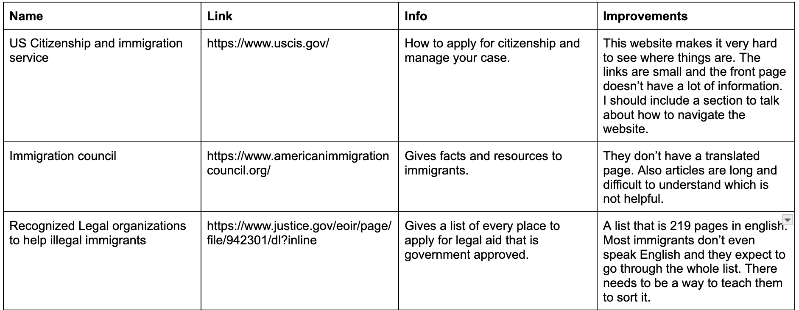

# Entry 4
##### 03/16/25

### Context

Over the last few days, I've had a lot of time to tinker. I used my free time to work on refining my skills like components, `fetch`, routing, and built-in JavaScript array functions. I think I've been getting good at components and making reusable code. I made a couple of reusable buttons:

```js
import { FirstButton, SecondButton } from "./Buttons";

const TinkerWithButtons = () => {
  return (
    <div className="flex gap-4 p-5">
      <FirstButton onClick={() => alert("Don't click my brother")}>
        Click me
      </FirstButton>
      <SecondButton onClick={() => alert("Don't click my sister")}>
        No, click me!
      </SecondButton>
    </div>
  );
};
```

I am able to edit their CSS when I need to, so I don't need to constantly make buttons. Also, this will work with the navbar so for every page we don't need to always remake it. Now that I have learned the basics, I started learning a bit about routing. The most important part of this app is going to be routing. I need to connect my frontend to my partner's backend, so I decided to work with an API to test my routing and fetching skills on different pages.

### Challenge 1: Fetching Data from an API

In order for our app to translate across **all** pages, we will need to fetch from the API every time a refresh happens. So I decided to start small with an API that will fetch data from one page. I used the [Lichess API](https://lichess.org/api#tag/Games/operation/gamePgn).

Working with this, I created one page with buttons. On the page, I wanted the API to be fetched by React and then display the two players who played the game. So I had to work on fetching it and creating the route in my tinker app. The problem was I was unsure if I had to call it each time on the new page or if there was a different way. So I followed a [guide](https://rapidapi.com/guides/fetch-api-react) on `GET` requests to make a simple page.

```js
const gameIds = ["gy9ZMvuTnb3P", "rAKKPNQHJkvJ", "uqIYWIN4hIcM"];

useEffect(() => {
  const getGames = async () => {
    try {
      const responses = await Promise.all(
        gameIds.map((id) =>
          fetch(`https://lichess.org/game/export/${id}?pgnInJson=true`).then((res) => res.json())
        )
      );
      setGames(responses);
      setLoading(false);
    } catch (error) {
      console.log("Error fetching games:", error);
    }
  };

  getGames();
}, []);

return (
  <div>
    <h1>My Chess Games</h1>

    {loading ? (
      <p>Loading...</p>
    ) : (
      games.map((game, index) => (
        <div key={index} style={{ marginBottom: "10px" }}>
          <button onClick={() => setSelectedGame(selectedGame === index ? null : index)}>
            Game {index + 1}: {game.players.white.userId} vs {game.players.black.userId}
          </button>

          {selectedGame === index && (
            <div>
              <p>
                <strong>White:</strong> {game.players.white.userId}
              </p>
              <p>
                <strong>Black:</strong> {game.players.black.userId}
              </p>
              <p>
                <strong>Moves:</strong> {game.moves}
              </p>
            </div>
          )}
        </div>
      ))
    )}
  </div>
);
```

So I tested this, and it seemed to work. A few times I had problems. First, the array was tricky because at first, I tried storing them as variables. When I figured out the arrays, I was so happy. Then it worked for a little bit, but I think I forgot to put a `}` somewhere, so it kind of stopped.

Still, while making this, I learned a lot. I had to do some research on [`.map`](https://developer.mozilla.org/en-US/docs/Web/JavaScript/Reference/Global_Objects/Map) and learned how it works with React. I often forgot to log errors, which made it extremely hard to debug and work through. Once, I made multiple re-renders on the page in an almost infinite loop.

Working with fetching data from an API on one page was challenging. The next step is to learn how to do this across multiple pages so it will work like I need it to in my app.

### Challenge 2: Research and Design!

Now that I had the basics of fetching and routing down (kind of), it was time to work on design. My partner and I agreed that around this point I would start working on the look and layout of the app. So I had to refresh my memory on Tailwind CSS and figure out how to structure it.

I started by setting up a Figma project. This forced me to actually think deeply about the app’s structure. What exactly do I want it to look like? Where should things go? How much spacing should I use? Should I go for a clean and simple look or something more dynamic? Wait, what color scheme should I use? Should I use cards or lists for displaying information?

It was clear I needed a plan, so I started listing out all the essential pages I wanted to include in the app:

- **Know Your Rights** – A page explaining immigrant rights. This would be important, but I needed to figure out how to present the information without confusing the users.
- **Resources** – This page would include links, contact information, and organizations that can actually help. The challenge here is deciding how to organize everything so users can find what they need easily.

  

  (^Resources I found)

- **About the Authors** – A section about me and my partner so people know who built the app and why. This should be simple.
- **Immigration Stories** – This would be the heart of the app—a place where people can read (or maybe even submit?) real stories. Like my grandma, who inspired me.

Now that I had a rough outline, I had to start experimenting. I played around with Tailwind, testing different font sizes, margins, and spacing. I sketched some layouts in Figma, and I looked at other websites for inspiration.

This step made me really think about what I want to include. I don't want to go overboard, but I do want it to be meaningful.

### Engineering Design Process

At this point in the EDP, I am ready to start prototyping. Over the next month into spring break, I will work on setting up the React app. I will do research during the school day and work on it on my personal computer at night. I also have to work with my partner to make sure his API will be compatible because he made it himself. I am ready to build my project!

### Skills

1. **Tinker, Tinker, Tinker** – I didn't get React right away, so I decided to play around with it. I tested ideas and thoughts. I have a whole folder dedicated to tinkering with my ideas. Working with an API is probably the most tinkering I've ever done. I read, then I didn't just copy and paste the code, I tried to write it. Some websites would give you whole code to copy, but I resisted unless I was really stuck. I wanted to make my own thing, which is why I chose the Lichess API. Not a lot of people know about it, and I had to discover it by just reading the docs.

2. **Take Breaks** – When I didn't get it or had a bug, I would keep trying. This made me more and more frustrated. In chess, when you go on a losing streak, we call it tilting. You get in your own head that you're bad, and the only way to cure it is to stop playing. So when I felt a similar feeling while coding, I took a break. At first, I felt like a failure for not being able to solve it right away. Then, as the day progressed, at random moments, I had new ideas. I was able to adjust and think about my code. New ideas came to me, and taking a break actually helped me solve more code!

[Previous](entry03.md) | [Next](entry05.md)
[Home](../README.md)
