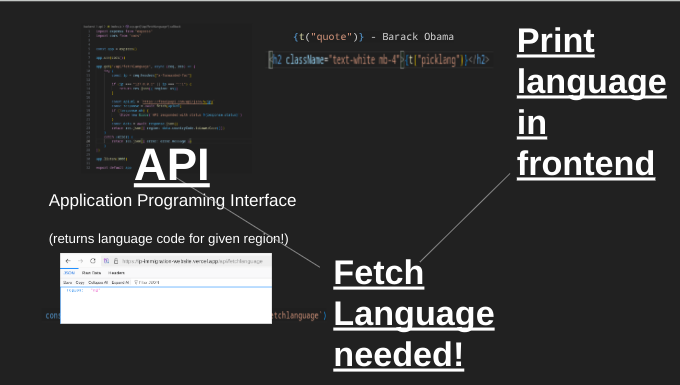

# Entry 6
##### 06/15/25

### Context

The final stage of the project has finally come. I needed to present my work with React and the website. My partner and I coordinated our presentation, made our slides, and added the finishing touches to our website. For our Beyond MVP, we decided to add more languages using the `t{"Quote"}` function we had made. At the same time, we had to present in front of the judges. Finally, our project won the SEP Freedom Project Fair. So, we had to present on stage!


### Challenge 1: The Finishing Touches

Before the blog gets into the experience of presenting on stage, we need to talk about the last bit of technical code. In order to add more translations, we used `.JSON` files and found the language code.



Once we had the language code, as seen in the image above, we could determine the language. We refactored our code a little bit in order to make this process more streamlined. For example, we had multiple files dependent on each other that we managed to refactor into the [initI18next.js file](https://github.com/jacobl3371/ip-immigration-website/blob/main/frontend/src/initI18n.js).

This new process helped us add more languages using JSON and bring them to the frontend. It allowed our website to support over 15 languages!

Furthermore, we fixed the automatic translation for the website. Now, no matter where you are in the world, it will translate into the language of the country you're in.

``` javascript
await Promise.all(
  languages.map(async (lang) => {
    const module = await import(\`./locales/\${lang.code}.json\`)
    i18next.addResourceBundle(
      lang.code,
      "translation",
      module.default || module
    );
  })
);

const isSupportedLang = languages.some((l) => l.code === lang)
if (!isSupportedLang) {
  i18next.changeLanguage("us")
  return;
}
```

These lines of code allow the user to translate the website based on their location. We fetch the language from the backend API, bring it into the frontend, and translate the user's experience based on their geoposition. If this doesn’t work, the language defaults to English. Adding these finishing touches allowed our project to be the best it could be. All that was left was the presentation.


### Challenge 2: Presenting

My partner Jacob Levit and I presented our project three times: first as an elevator pitch to the judges, then to our class, and finally on stage in the auditorium during the SEP Showcase. It was a great honor for both of us, but it was also a challenge to rehearse and get everything just right.

#### The Elevator Pitch

The elevator pitch is a quick speech to the judges to show off what we made. My job was to present the React portion of the project. When I arrived, I found out Jacob and I were going to be one of the first teams the judges visited. We got prepared and pulled out the document we worked on together. We had written a few key points to say to the judges.

When the judges arrived, we talked about how immigrants coming to the U.S. need translation services. We showed off our website, explaining how we made it using [Express.js](https://expressjs.com/), [React](https://react.dev/), and [Vite](https://vite.dev/). They complimented us on how our project could actually be used in the community. We felt like the elevator pitch was a success. From the elevator pitch I tookaway that we need to focus more on the immigration portion of the project.

#### The In-Class Presentation

Our in-class presentation was the most familiar people but that didn’t mean it was easy. We had to explain our technical work in a way that everyone could understand, even if they didn’t know React or JavaScript. I focused on walking through how the translation feature worked and why it mattered. Some classmates were surprised our site could auto-detect location and language. It felt good to show off the work and hear questions from people who were genuinely curious. They seemed to be very intrested in our project which made me happy. From the in-class presentation i leaned to make eye contact and be prepared who manages the computer.

#### The SEP Showcase

The final presentation was on stage during the SEP Showcase. It was a packed auditorium, and we had to speak clearly and confidently in front of students, teachers, judges, and even a few visitors from outside the school. I was nervous to shwo off my code still, I felt prod walking on that stage. We introduced our website, talked about why we built it, and showed a quick live demo. I explained the translation system and how it could help real people. The audience clapped when we finished, and I felt like all the stress and debugging paid off. Being recognized as one of the winning projects made it all even more memorable. I wish we made the presentation a little shorter because it ran for 12 minutes and I could tell the audience began to get bored. I learned not to focus so much on the technical details.


### Engineering Design Process
At this point in the EDP we are on the last step, communicate results. Our presentation made me realize how important immigrant communties are. How they are vulnerable and need support. Our website brought attention to this issue and helped solve it.

### Skills

- **Technical Skill**: I learned how to use `i18next` and dynamic imports to build multilingual support in a React project. It taught me a lot about code structure, backend/frontend connection, and geolocation. I also learned how to work with Vite and build large projects with complicated code.

- **Presentation Skill**: I got better at public speaking and explaining technical concepts to both judges and classmates. Rehearsing, timing, and making eye contact are things I had to improve on. I also had to work on managing my speaking time. This skill has already helped me give presentation that are quick and easy to understand.

## Our project

* [Website](https://immigration-resource.vercel.app/)
* [Presentation Plan](https://immigration-resource.vercel.app/)
* [Slides](https://docs.google.com/presentation/d/1q1zGLP7vPFQL8w3w1T0zRHO0r3UDH2-i0hvRYW0ZQbo/edit?slide=id.g3362d5066a9_0_66#slide=id.g3362d5066a9_0_66)

***Huge Thank you to [Jacob Levit](https://github.com/jacobl3371) for working with me***


[Previous](entry05.md) | [Next](entry07.md)
[Home](../README.md)

