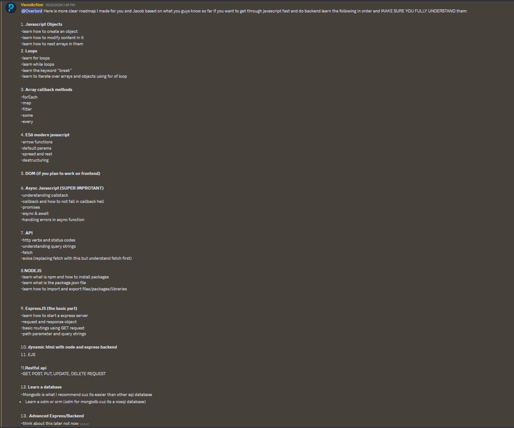

# Tool Learning Log

## Tool: **Express.js**

## Project: **Translator for Immigrants**

---

### 10/18/24:
* I started the download for express.js
* It was hard because I didn't know a lot about downloading frameworks
* You can get express [here](https://expressjs.com/)
* Me and Jacob had to problem solve becasue we can't download Node in browser IDE
* This led me to get [VScode](https://code.visualstudio.com/download) and [Github Desktop](https://desktop.github.com/download/)
* Once I set everything up I watched a youtube video on [Vscode](https://www.youtube.com/watch?v=ORrELERGIHs)

### 10/20/24:

* I started working with express.js
* I learned how to send a string:
``` javascript
app.get('/', (req, res) => {
    res.send("Hello World")

})
```
* I was having trouble previewing my code so I asked my friend Shi-Jun:

* We hopped on Voice call together and he helped me set it up:

* Once I finished learning some of the basics from a [YouTube video](https://www.youtube.com/watch?v=SccSCuHhOw0&t=134s)
### Next time
* Next week I will finish the YouTube video and begin working on my own project
* I hope to begin working on the translator soon
* I also hope to explore Next.js and react to see how they can help

### 10/23
* Watched [this video](https://www.youtube.com/watch?v=lY6icfhap2o) on middle wear and took notes
* In Express.js, middleware functions are functions that have access to the request object (req), the response object (res), and the next middleware function in the application's request-response cycle.
* I also finished [The basics YouTube video](https://www.youtube.com/watch?v=SccSCuHhOw0&t=134s) and began building on my own
### 11/3
* I began learning node commands from [The Node website](https://nodejs.org/api/cli.html)
* The most important one was `node app.js` (app.js is just the name). This command is used to run the code to the port that you choose here:
```js
const express = require('express');
const session = require('express-session');
const bodyParser = require('body-parser');

const app = express();
const PORT = 3000;

```
* I want to start my own project but I don't have time. I am following this roadmap:

* My next step is ES6 models with arrow notation

##### Problems I encountered
* I just figured out how to run my code in Github CodeSpaces, so that should work better now
    * I have to change the port each time which is annoying
* Figuring out how to code my own project is hard when I don't know that much about conditionals and loops so I will work on that
* ES6 arrow notation is a lot like Greater than and less than signs which is confusing me.

### Nest steps:
* Watch a video to get ahead on JavaScript
* Begin working on API development
* Work on Frontend of our website with Jacob

<!--
* Links you used today (websites, videos, etc)
* Things you tried, progress you made, etc
* Challenges, a-ha moments, etc
* Questions you still have
* What you're going to try next
-->

### 11/10
* Today  I learned key's from Shi-Jun and data types. I wanted to use it for a different project but I didn't understand the documentation so I asked Shi-Jun for help


* I now know that keys can be used to hold data types kind of like an array. It can be helpful for making info appear on the website

### 11/11

* I tinkered with express and now am trying to build a simple project. I am going to try and build a simple messaging app
* Before that I want to finish learning the basics of express.
* app is an instance of express.
* METHOD is an HTTP request method, in lowercase.
* PATH is a path on the server.
* HANDLER is the function executed when the route is matched.

``` js
app.use(express.static('public'))
app.use(express.static('files'))
```
* The above code is a for static directories and libraries


### 11/17

* I was thinking to myself about why I would use Express so I read this [article](https://www.besanttechnologies.com/what-is-expressjs#:~:text=It%20is%20used%20for%20designing,and%20API%20without%20any%20effort.)
* I continued to tinker with express

```js
extends layout

block content
  h1= library
  p Welcome!

  h2 Hello reader!

  p The library has the following record counts:

  ul
    li #[strong Books:] !{book_count}
    li #[strong Copies:] !{book_instance_count}
    li #[strong Copies available:] !{book_instance_available_count}
    li #[strong Authors:] !{author_count}
    li #[strong Genres:] !{genre_count}

```

I started working on my own little library counter to tinker

* I also learned how express can be used to make a whole website in JavaScript

#### Next time

* continue working on my little project
* I need to add the names of the books to the library


### 11/18/24

* Watched [this video](https://www.youtube.com/watch?v=lkjrUW8fI40)
* I found [these notes](https://smoljames.com/notes/javascript#chapter-1---introduction-to-javascript-js) online for Javascript

### 11/24/24

* I continued to work on my wook sorter but I am struggling with making it show
* I went back to the doccumentation to try and understand routing again
* I watched [this video](https://www.youtube.com/watch?v=0Hu27PoloYw) to try to understand routing

```js
const express = require('express');
const bodyParser = require('body-parser');

const app = express();
const PORT = 3000;

app.use(bodyParser.json());
app.use(bodyParser.urlencoded({ extended: true }));

app.get('/', (req, res) => {
  res.send(`
  `);
});

```

* My code doesn't respond to the HTMl file and I don't know why

### 12/08/24

* I figured out that in `red.send("<-- HTML Here -->")` you add the HTMl
* I also learned that you should return it in regular Javascript when using Next.JS
```js
let books = [
  { id: 1, title: 'The Great Gatsby', author: 'F. Scott Fitzgerald', year: 1925 },
  { id: 2, title: 'To Kill a Mockingbird', author: 'Harper Lee', year: 1960 },
  { id: 3, title: '1984', author: 'George Orwell', year: 1949 },
];
```
* These are the ID for the books so I can sort them
* I need to add more values so that the compuer can organize them how I want
* I am thinking about learning about how to set serial numbers to the book with `Math.random` and 6 digits.
* My thought process is this:

1. Use ` Math.floor(Math.random() * 1000000000)` to create a serial number
2. I would then assign each book a number from which it could be called
3. This would activate a return feature that brings the book to the user if they know the serial number


### 03/02/25
* So far I have done a lot with my freedom project
* I learned how to navigate `pages/` and automatic route creation
```js
import { useState, useEffect } from 'react'

export default function TinkerComponent() {
  const [count, setCount] = useState(0)
  const [data, setData] = useState(null)

  useEffect(() => {
    fetch('/api/hello')
      .then(res => res.json())
      .then(json => setData(json.message))
  }, [])

  return (
    <div style={{ textAlign: 'center', padding: '20px' }}>
      <h1>Next.js Tinkering</h1>
      <p>Count: {count}</p>
      <button onClick={() => setCount(count + 1)}>Increment</button>
      <p>API Response: {data ? data : 'Loading...'}</p>
    </div>
  )
}

```

* This code `useState` for API data
* Then set them to zero so they can be changed later
* The best part of Next.js is that you can reuse the code
* Learning next to combine it with Node.Js as reccommened by many people
*The JSX has reusable code which counts!
```js
import Link from 'next/link'

export default function Home() {
  return (
    <div style={{ textAlign: 'center', padding: '20px' }}>
      <h1>Welcome to My Next.js App</h1>
      <p>This is the home page</p>
      <Link href="/about">Go to About Page</Link>
      <br />
      <Link href="/user/123">Go to User 123</Link>
    </div>
  )
}
```

* The important part is the `'next/link'`
  * This works to send it to diffrent pages
  *The links work to quickly connect


